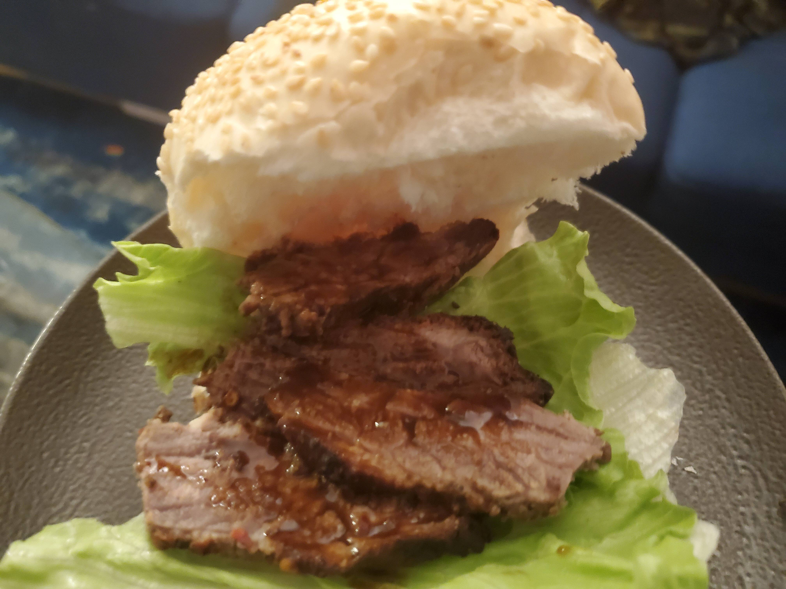

## Ingredients

* Brisket
* Marinade:
    * 1 part Worcestershire sauce
    * 1 part soy sauce
    * 1 part bourbon
    * Couple tablespoons of minced garlic
    * Couple tablespoons of mustard
    * Ground black pepper
    * Slightly more chilli flakes than I intended
    * Couple bay leafs

## Equipment required

* Marinading vessel
* Cooking dish
* Oven

## Method

1. Mix all marinade ingredients
2. Coat brisket in marinade and leave in fridge overnight
    * Ensure meat is covered by marinade - Pro tip: Putting into a large sandwich bag and squeezing out the air will leave more bourbon for drinking
    * "Overnight" should preferably last from early evening (around 2am) until early morning (2pm)
3. Put in oven with fat side facing up
4. Cook at low temperature until done
5. Rest meat for a bit while enjoying a small glass of bourbon
6. Slice or shred meat, ensuring you eat at least 1/3 of it while doing so
7. Later, while watching [Unbreakable Kimmy Schmidt](https://www.imdb.com/title/tt3339966/) and writing [this recipe](./brisket.md), throw the word "brisket" into [DuckDuckGo](https://duckduckgo.com/) to double check the spelling, then forget why you did that and click through to [the Wikipedia page](https://en.wikipedia.org/wiki/Brisket) and see [American](https://en.wikipedia.org/wiki/File:BeefCutBrisket.svg) and [British](https://en.wikipedia.org/wiki/File:British_Beef_Cuts.svg) brisket cuts are quite different, and be like "whatttt???"
8. Have some more bourbon
